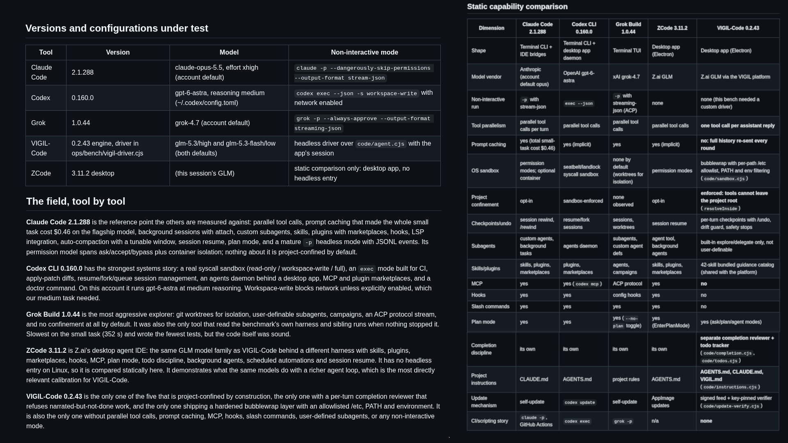
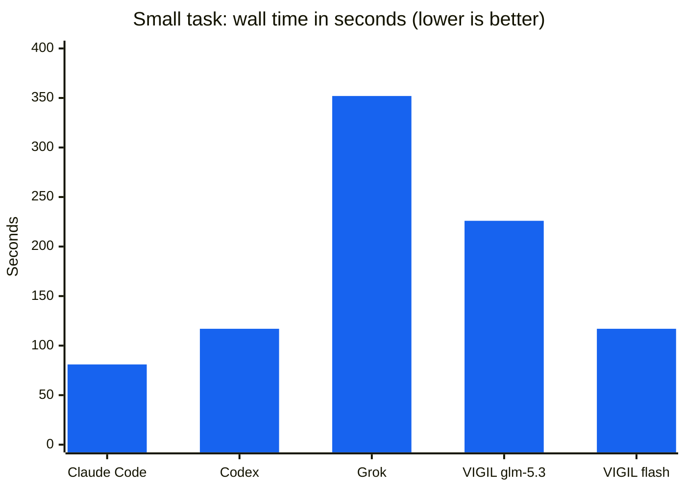
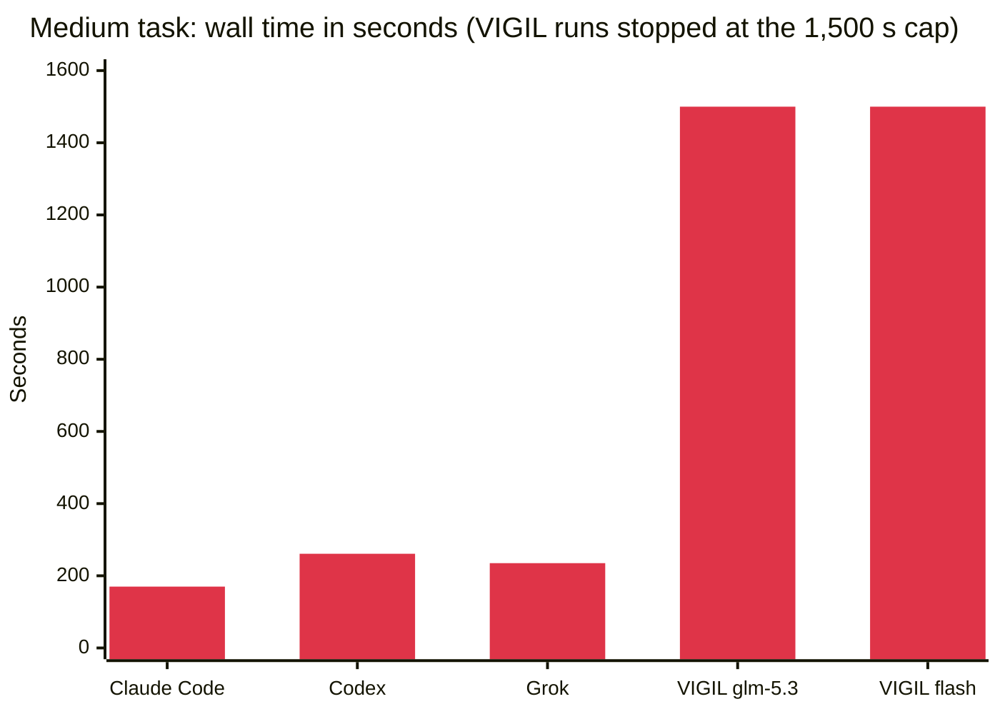
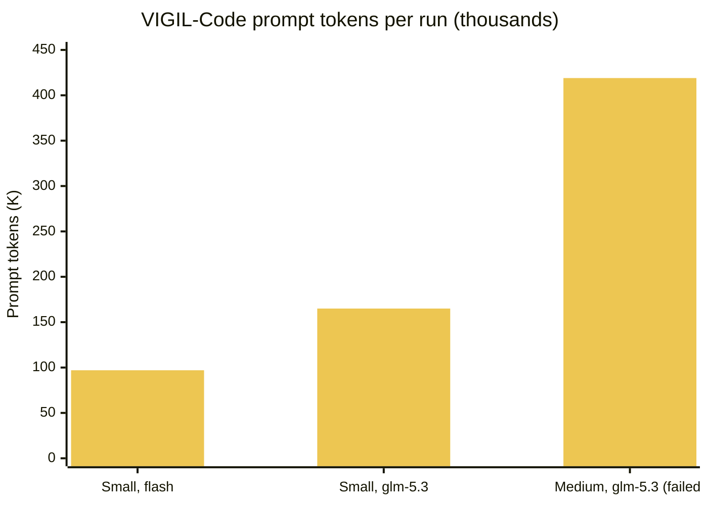

# VIGIL-GLM Reports

**Benchmarks and capability reviews for [VIGIL-Code](https://github.com/BradHeff/VIGIL-GLM), the desktop code agent of the [VIGIL GLM platform](https://vigilglm.ai/start).**

  
  
  
  
  

  <a href="REPORT.md"><b>Read the full report</b></a> ·
  <a href="REPORT.md#static-capability-comparison">Capability matrix</a> ·
  <a href="REPORT.md#medium-task-results">Benchmark results</a> ·
  <a href="REPORT.md#the-repair-fix-and-gap-plan-for-the-next-release">Repair plan</a>

 

Snapshot of the report's comparison tables. Click it to open <a href="REPORT.md">REPORT.md</a>.

---

## The short version

VIGIL-Code 0.2.43 was run against Claude Code, Codex CLI and Grok Build on three identical build tasks, each in its own isolated sandbox, with objective checks after every run. ZCode was compared statically because it has no headless mode on Linux.

- **Small task:** all five configurations shipped working code. VIGIL-Code's default flash setup tied Codex for second-fastest at 117 s.
- **Medium task:** every competitor finished with a green suite in under 4.5 minutes. Both VIGIL-Code configurations hit the 25-minute cap without a running server.
- **Why:** the engine runs one tool call per model reply and has no prompt caching, so every step is a full round-trip that re-sends the whole history. The GLM models aren't the bottleneck; the agent loop is.
- **Where VIGIL-Code leads:** it is the only one of the five that confines its tools to the project root by construction, ships a hardened bubblewrap sandbox, takes per-turn checkpoints, and runs an independent completion reviewer.

## Scoreboard

| Agent | Small | Medium | Continuation |
| :--- | :---: | :---: | :---: |
| **Claude Code** 2.1.288 · opus 5.5 / xhigh | ✅ 81 s · 19 tests | ✅ 170 s · 27/27 | ✅ 375 s · 53/53 |
| **Codex CLI** 0.160.0 · gpt-6-astra / medium | ✅ 117 s · 7 tests | ✅ 261 s · 32/32 | ✅ 245 s · 41/41 |
| **Grok Build** 1.0.44 · grok-4.7 | ✅ 352 s · 5 tests ¹ | ✅ 235 s · 27/27 | ✅ 727 s · 36/36 |
| **VIGIL-Code** 0.2.43 · glm-5.3 / high | ✅ 226 s · 10 tests | ❌ 25 min cap · 0/2 | ➖ not run |
| **VIGIL-Code** 0.2.43 · glm-5.3-flash / low | ✅ 117 s · 10 tests | ❌ 25 min cap · 0/1 | ➖ not run |
| **ZCode** 3.11.2 | static only | static only | static only |

¹ In the first small-task round Grok read the benchmark harness and sibling sandboxes. Later runs use one isolated root per tool and task. See the <a href="REPORT.md#benchmark-integrity-note">integrity note</a>.

## Charts

For scale: Claude Code's entire small-task run cost **$0.46** on its flagship model.

## The repair plan

Every item in the report names the code that changes and the test that proves the fix.

| | Item | Ships in |
| :---: | :--- | :---: |
| 🔴 **P0-1** | [Execute every tool call in a reply, not just the first](REPORT.md#p0-1-execute-every-tool-call-in-a-reply-not-just-the-first) | 0.2.44 |
| 🔴 **P0-2** | [Cap tool-result sizes in the working context](REPORT.md#p0-2-cap-tool-result-sizes-in-the-working-context) | 0.2.44 |
| 🔴 **P0-3** | [Make stream and transport errors recoverable mid-turn](REPORT.md#p0-3-make-stream-and-transport-errors-recoverable-mid-turn) | 0.2.44 |
| 🟠 **P1-4** | [Ship the headless driver as `vigil-code exec`](REPORT.md#p1-4-ship-the-headless-driver-as-vigil-code-exec) | 0.2.45 |
| 🟠 **P1-5** | [Suggest flash for greenfield, glm-5.3 for existing code](REPORT.md#p1-5-model-setting-guidance-default-flash-for-greenfield-flagship-for-edits) | 0.2.45 |
| 🟠 **P1-6** | [Show token and request totals per turn](REPORT.md#p1-6-tighten-turn-latency-instrumentation) | 0.2.44 |
| 🟡 **P2-7** | [MCP client support](REPORT.md#p2-7-mcp-client-support) | 0.3 |
| 🟡 **P2-8** | [Slash commands and user-defined subagents](REPORT.md#p2-8-slash-commands-and-user-defined-subagents) | 0.3 |
| 🟡 **P2-9** | [Document the confinement advantage](REPORT.md#p2-9-keep-the-confinement-advantage-and-document-it) | 0.3 |
| ⚪ **P3-10** | [Prompt caching or server-side turn state](REPORT.md#p3-10-prompt-caching-or-server-side-turn-state) | platform |

🔴 P0 blocks the next release · 🟠 P1 belongs in it · 🟡 P2 is the following release · ⚪ P3 is directional

## How the benchmark was run

<b>Tasks, harness and fairness rules</b>

 

| Task | What the agent had to build |
| :--- | :--- |
| **Small** | A dependency-free Node todo CLI with a `node:test` suite |
| **Medium** | An Express + better-sqlite3 notes REST API with validation, search, pagination, a README and at least 12 passing tests |
| **Continuation** | The medium build extended in place with scrypt auth, per-user isolation, Bearer protection and a rate limit, with the whole suite green |

- Identical prompt bytes for every tool, one isolated sandbox per tool and task.
- Each tool ran through its own non-interactive mode with full-auto approvals (`claude -p`, `codex exec`, `grok -p`). VIGIL-Code has no headless mode yet, so it ran through a driver that wires the desktop app's own engine modules to the platform API.
- Objective checks afterwards: tests run from a clean state, functional probes against the running program, and a file and line inventory.
- Timeout of 25 to 40 minutes per run, up to 100 turns, all runs on the same machine.

The harness (`ops/bench/`) lives in the main [VIGIL-GLM](https://github.com/BradHeff/VIGIL-GLM) repository. Code paths cited in the report, such as `code/agent.cjs`, are relative to that repository.

## In this repository

| File | Contents |
| :--- | :--- |
| [`REPORT.md`](REPORT.md) | Full report: versions, static capability matrix, per-tool notes, results for all three tasks, integrity note, and the P0–P3 repair plan |
| [`Findings.png`](Findings.png) | Snapshot of the report's comparison tables |

 

These reports cover <a href="https://vigilglm.ai/start"><b>VIGIL GLM</b></a>, a private AI platform running GLM models. Start at <a href="https://vigilglm.ai/start">vigilglm.ai/start</a>.

