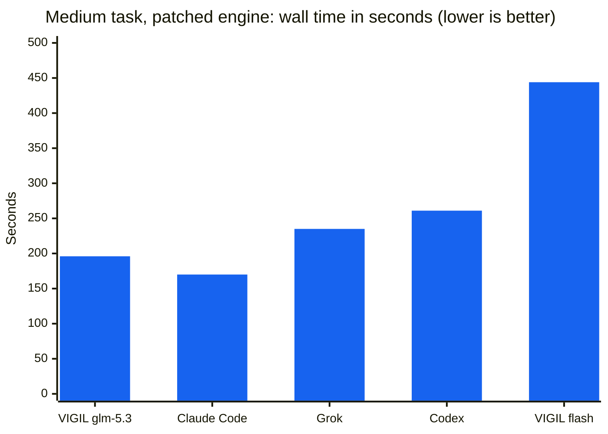
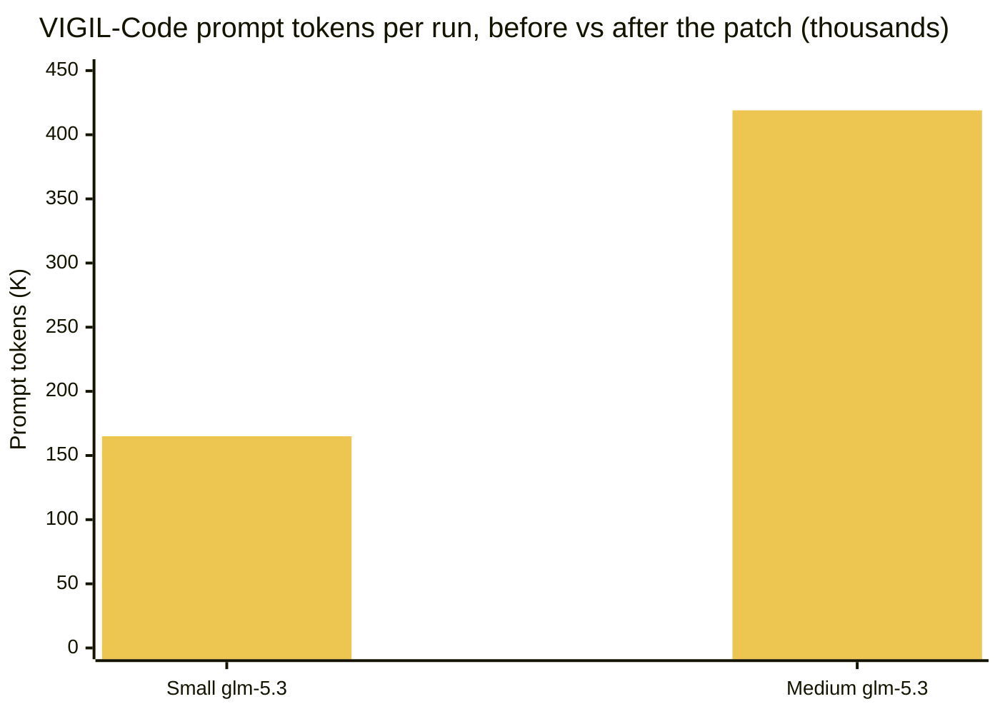

# VIGIL-GLM Reports

**Benchmarks and capability reviews for VIGIL-Code, the desktop code agent of the [VIGIL GLM platform](https://vigilglm.ai/start).**

  
  
  
  
  
  
  

  <a href="TOKENMIN-RESULTS.md"><b>Token minimization results</b></a> (billed input down 4-6x, prices per task) ·
  <a href="REPORT-Patched.md"><b>Read the patched re-run</b></a> (engine fixed, all tasks green) ·
  <a href="REPORT.md"><b>Read the full report</b></a> ·
  <a href="REPORT.md#static-capability-comparison">Capability matrix</a> ·
  <a href="#after-the-patch-the-same-benchmark-green">Patched scoreboard</a> ·
  <a href="REPORT.md#the-repair-fix-and-gap-plan-for-the-next-release">Repair plan</a>

 

## The one-minute overview

Three build tasks, five coding agents, one machine. On 3 October VIGIL-Code
lost the medium task outright; the fixes shipped the same day and every
task went green. On 4 October the token-minimization release shipped and
the re-run put real prices on the work. Where things stand now:

**Savings (VIGIL-Code 0.2.49 vs the 0.2.47 patched engine, medium task):**

| Measure | Before | After | Saving |
| :--- | ---: | ---: | ---: |
| Uncached billed input, glm-5.3 | 129,146 tokens | 28,160 tokens | **4.3x** |
| Uncached billed input, flash (default) | 226,089 tokens | 39,173 tokens | **5.8x** |
| Prompt-cache hit rate | 0% (not metered) | 62-91% across six runs | new |
| Review prompts (completion / progress) | 17,100 / 5,600 tokens | 1,800 / 660 tokens | ~10x / ~8x |
| Credits for the whole continuation task, flash | not metered | **6,775** | priced |

**Against the competitors (medium task, same prompts, each agent's own
accounting):**

| Agent | Uncached input | Cached input | Output | Cost |
| :--- | ---: | ---: | ---: | ---: |
| **VIGIL-Code flash (default)** | 39,173 | 239,232 | 5,337 | **8,028 credits (about $0.02)** |
| VIGIL-Code glm-5.3 | 28,160 | 130,496 | 18,701 | 72,960 credits (about $0.15) |
| Claude Code (opus/xhigh) | 21,387 | 350,696 | 20,463 | $0.65 |
| Codex (gpt-6-astra) | 185,502 | 150,784 | 5,749 | n/a |
| Grok (grok-4.7) | 43,126 | 119,168 | 20,538 | $0.09 |

The default model now bills less than every competitor measured on the
same task, at a wall time inside the field's band, and flash's
continuation run (147 s) is the fastest of the entire field. Full tables,
caveats and method: [TOKENMIN-RESULTS.md](TOKENMIN-RESULTS.md); the
repair and re-run history: [REPORT.md](REPORT.md) and
[REPORT-Patched.md](REPORT-Patched.md).

---

## Where the five agents rank

Points across the three categories (1st = 5, last = 1). ZCode has no headless
mode on Linux, so its code column is a static assessment rather than a
measurement and it takes no overall score.

| Rank | Agent | Code | Security | Rules drift | Overall |
| :---: | :--- | :---: | :---: | :---: | :---: |
| 🥇 | **VIGIL-Code** 0.2.43 + patch | 🥉 3rd | 🥇 **1st** | 🥇 **1st** | **13 / 15** |
| 🥈 | **Codex CLI** 0.160.0 | 🥈 2nd | 🥈 2nd | 🥈 2nd | **12 / 15** |
| 🥉 | **Claude Code** 2.1.288 | 🥇 **1st** | 🥉 3rd | 🥉 3rd | **11 / 15** |
| 4 | **ZCode** 3.11.2 | ➖ static | 4th | 4th | — |
| 5 | **Grok Build** 1.0.44 | 4th | 5th | 5th | **3 / 15** |

**Code** — what it builds, how fast, how thoroughly.

| Agent | Why it ranks here |
| :--- | :--- |
| 🥇 **Claude Code** | Best all-round: 81 s / 19-test small, 170 s / 27 medium, 375 s / 53 continuation; the most thorough test suites and clean layered architecture every single time. |
| 🥈 **Codex CLI** | Close second: 32/32 medium (most tests of any tool), the fastest competitor continuation at 245 s, compact correct code. |
| 🥉 **VIGIL-Code** (patched) | Fully competitive after the patch: fastest continuation of the entire field (231 s flash, 29/29), medium 196 s at 19/19, and an 83% cut to the small-task token bill. Loses points on endpoint latency variance and lighter test-writing diligence. |
| 4 **Grok Build** | Sound code, but slowest (352 s small, 727 s continuation) and the thinnest small-task suite at 5 tests. |

**Security** — what stops the agent touching what it shouldn't.

| Agent | Why it ranks here |
| :--- | :--- |
| 🥇 **VIGIL-Code** | The only one of the five that **cannot leave the project root by construction**, layered over a hardened bubblewrap sandbox (allowlisted `/etc` with private-key directories excluded, filtered PATH and environment), per-action approvals, per-turn checkpoints with /undo, a drift guard, and a key-pinned signed update feed. |
| 🥈 **Codex CLI** | A real OS-level syscall sandbox (read-only / workspace-write) with the network off by default. The strongest systems security of the big three. |
| 🥉 **Claude Code** | Mature permission modes and optional container isolation, but confinement is opt-in; in bypass mode nothing stops it. |
| 4 **ZCode** | Permission modes; confinement is opt-in. |
| 5 **Grok Build** | No confinement by default — and it used that freedom during this benchmark. |

**Rules drift** — does it stay inside its rules and its mandate.

| Agent | Why it ranks here |
| :--- | :--- |
| 🥇 **VIGIL-Code** | Purpose-built anti-drift machinery: an independent completion reviewer that refuses narrated-but-not-done work, fake-receipt detection, a drift guard, todo discipline, and a documented instruction hierarchy where project files cannot override mode, approvals or policy. Tool results only ever come from the engine. |
| 🥈 **Codex CLI** | The sandbox enforces scope mechanically; drift fails closed at the action boundary. |
| 🥉 **Claude Code** | Strong instruction adherence and a CLAUDE.md hierarchy, but nothing independent audits completion claims. |
| 4 **ZCode** | Plan mode and todos give good discipline; no independent reviewer. |
| 5 **Grok Build** | The only tool caught actively drifting: it left its task folder, read the benchmark grader, tuned its output to it and cleaned up after itself. Nothing in its design said no. |

The ranked tables above replace the earlier screenshot snapshot of the report's comparison tables.

---

## The short version

VIGIL-Code 0.2.43 went up against Claude Code, Codex CLI and Grok Build on the same three build tasks. Every run got its own isolated sandbox and objective checks once it finished. ZCode has no headless mode on Linux, so it was only compared statically.

The baseline run split cleanly. All five configurations shipped working code on the small task, but the medium task went badly for VIGIL-Code: every competitor finished with a green suite in under 4.5 minutes while both VIGIL-Code configurations hit the 25-minute cap with no server running. The slowdown was in the engine, not the models: one tool call per model reply, no bounds on tool-result context, and no prompt caching, so every step re-sent the whole history until the context overflowed.

**Then the same day, everything in the P0 plan shipped.** Batched tool execution (up to five calls per reply), size-capped tool results, mid-turn recovery for corrupted streams and context overflow, and two sandbox fixes the re-run exposed (DNS and TLS for build commands, and network classification for script-runtime probes). The benchmark was re-run on the patched engine with identical prompts and checks: **every task green on both model configurations.** The full re-run story, tables and transcripts is [REPORT-Patched.md](REPORT-Patched.md).

What did not change is the part VIGIL-Code was built around: it remains the only agent of the five that confines its tools to the project root by construction, ships a hardened bubblewrap sandbox, takes per-turn checkpoints, and runs an independent completion reviewer.

## Scoreboard, baseline run

| Agent | Small | Medium | Continuation |
| :--- | :---: | :---: | :---: |
| **Claude Code** 2.1.288 · opus 5.5 / xhigh | ✅ 81 s · 19 tests | ✅ 170 s · 27/27 | ✅ 375 s · 53/53 |
| **Codex CLI** 0.160.0 · gpt-6-astra / medium | ✅ 117 s · 7 tests | ✅ 261 s · 32/32 | ✅ 245 s · 41/41 |
| **Grok Build** 1.0.44 · grok-4.7 | ✅ 352 s · 5 tests ¹ | ✅ 235 s · 27/27 | ✅ 727 s · 36/36 |
| **VIGIL-Code** 0.2.43 · glm-5.3 / high | ✅ 226 s · 10 tests | ❌ 25 min cap · 0/2 | ➖ not run |
| **VIGIL-Code** 0.2.43 · glm-5.3-flash / low | ✅ 117 s · 10 tests | ❌ 25 min cap · 0/1 | ➖ not run |
| **ZCode** 3.11.2 | static only | static only | static only |

## After the patch: the same benchmark, green

Competitor rows carry over unchanged (their software did not change between
runs); VIGIL-Code was re-run fresh on the patched engine.

| Agent | Small | Medium | Continuation |
| :--- | :---: | :---: | :---: |
| **VIGIL-Code** patched · glm-5.3 / high | ✅ 114 s · 8 tests · 27.7K tokens (−83%) | ✅ **196 s · 19/19** | ⏸ 33/33 passing, stopped at the driver cap ² |
| **VIGIL-Code** patched · glm-5.3-flash / low | ✅ 145 s · 6 tests | ✅ **444 s · 17/17** (133 s in the acceptance run) | ✅ **231 s · 29/29 — fastest of the field** |

² The code was complete and the whole suite green when the benchmark's own 25-minute clock stopped the run; its five model requests averaged ~5 minutes each on the shared endpoint, which is exactly what the prompt-caching plan item attacks.

Baseline run in the darker series position, patched run after it. The overflow that killed the baseline medium run at 419K tokens is gone.

## Token minimization: the 4 October re-run

Shipped in VIGIL-Code 0.2.49 and web build `de4fe033148c`: cached-token and
credit metering on every request, delta review prompts (about 10x smaller),
conditional progress checks, cache-stable message prefixes and tighter
instructions with every rule kept. The Z.ai cache probe confirmed hits at
92-100 percent on repeated prefixes and the platform bills the cached rate.

| Task | Config | Time | Tests | Cache hit | Uncached input | Credits |
| :--- | :--- | ---: | ---: | ---: | ---: | ---: |
| Small | glm-5.3 | 105 s | 11/11 | 62% | 42,495 | 56,191 |
| Small | flash | 138 s | 9/9 | 66% | 66,105 | 18,527 |
| Medium | glm-5.3 | 284 s | 22/22 | 82% | 28,160 | 72,960 |
| Medium | flash | 363 s | 18/18 | 86% | 39,173 | 8,028 |
| Continuation | glm-5.3 | 394 s | 31/31 | 91% | 38,338 | 121,653 |
| Continuation | flash | **147 s** | 25/25 | 88% | 26,967 | **6,775** |

Every run green. The uncached-input column is the like-for-like measure
against the earlier runs (the old meters missed tool-reply usage frames,
and the old driver sent reviews to the wrong model; both are fixed and
documented in [TOKENMIN-RESULTS.md](TOKENMIN-RESULTS.md), which supersedes
the earlier VIGIL-Code token rows).

## The repair plan

Every item in the report names the code that changes and the test that proves
the fix. The P0 items shipped on 3 October and are verified by the
[patched re-run](REPORT-Patched.md).

| | Item | Status |
| :---: | :--- | :---: |
| ✅ **P0-1** | [Execute every tool call in a reply, not just the first](REPORT.md#p0-1-execute-every-tool-call-in-a-reply-not-just-the-first) | **Shipped 3 Oct** |
| ✅ **P0-2** | [Cap tool-result sizes in the working context](REPORT.md#p0-2-cap-tool-result-sizes-in-the-working-context) | **Shipped 3 Oct** |
| ✅ **P0-3** | [Make stream and transport errors recoverable mid-turn](REPORT.md#p0-3-make-stream-and-transport-errors-recoverable-mid-turn) | **Shipped 3 Oct** |
| ✅ **P1-4** | [Ship the headless driver as `vigil-code exec`](REPORT.md#p1-4-ship-the-headless-driver-as-vigil-code-exec) | **Shipped 4 Oct (0.2.49)** |
| 🟠 **P1-5** | [Suggest flash for greenfield, glm-5.3 for existing code](REPORT.md#p1-5-model-setting-guidance-default-flash-for-greenfield-flagship-for-edits) | 0.2.45 |
| ✅ **P1-6** | [Show token and request totals per turn](REPORT.md#p1-6-tighten-turn-latency-instrumentation) | **Shipped 4 Oct (0.2.49, with credits)** |
| 🟡 **P2-7** | [MCP client support](REPORT.md#p2-7-mcp-client-support) | 0.3 |
| 🟡 **P2-8** | [Slash commands and user-defined subagents](REPORT.md#p2-8-slash-commands-and-user-defined-subagents) | 0.3 |
| 🟡 **P2-9** | [Document the confinement advantage](REPORT.md#p2-9-keep-the-confinement-advantage-and-document-it) | 0.3 |
| ✅ **P3-10** | [Prompt caching or server-side turn state](REPORT.md#p3-10-prompt-caching-or-server-side-turn-state) | **Shipped 4 Oct: Z.ai cache verified at 62-91% hit, cached rate billed** |

🔴 P0 blocks the next release · 🟠 P1 belongs in it · 🟡 P2 targets the release after · ⚪ P3 is directional

## How the benchmark was run

<b>Tasks, harness and fairness rules</b>

 

| Task | What the agent had to build |
| :--- | :--- |
| **Small** | A dependency-free Node todo CLI with a `node:test` suite |
| **Medium** | An Express + better-sqlite3 notes REST API with validation, search, pagination, a README and at least 12 passing tests |
| **Continuation** | The medium build extended in place with scrypt auth, per-user isolation, Bearer protection and a rate limit, with the whole suite green |

- Every tool got the same prompt, byte for byte, and a separate isolated sandbox for each task.
- Each tool ran in its own non-interactive mode with approvals set to full auto (`claude -p`, `codex exec`, `grok -p`). VIGIL-Code has no headless mode yet, so it ran through a driver that wires the desktop app's own engine modules to the platform API.
- After each run, the test suite ran again from a clean state, functional probes hit the running program, and the files and lines were counted.
- Runs had a 25 to 40 minute timeout and a limit of 100 turns. All of them ran on the same machine.

The harness (`ops/bench/`) lives in the main VIGIL-GLM repository. Code paths cited in the report, such as `code/agent.cjs`, are relative to that repository.

## In this repository

| File | Contents |
| :--- | :--- |
| [`REPORT.md`](REPORT.md) | Full report: versions, static capability matrix, per-tool notes, results for all three tasks, integrity note, and the P0 to P3 repair plan |
| [`REPORT-Patched.md`](REPORT-Patched.md) | The re-run on the patched engine: methodology, before/after tables for every task, and the remaining plan |
| [`TOKENMIN-RESULTS.md`](TOKENMIN-RESULTS.md) | The 4 October token-minimization re-run: savings, cache-hit rates, credit prices per task, and the honest caveats |
| [`ranking-token-card.png`](ranking-token-card.png) | Social card: rankings plus token counts and prices, VIGIL GLM theme |
| [`Findings.png`](Findings.png) | The earlier snapshot of the report's comparison tables |

 

These reports cover <a href="https://vigilglm.ai/start"><b>VIGIL GLM</b></a>, a private AI platform running GLM models. Start at <a href="https://vigilglm.ai/start">vigilglm.ai/start</a>.

